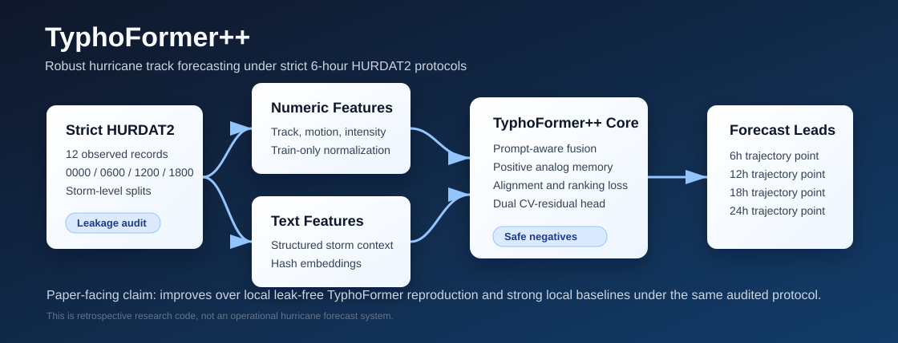
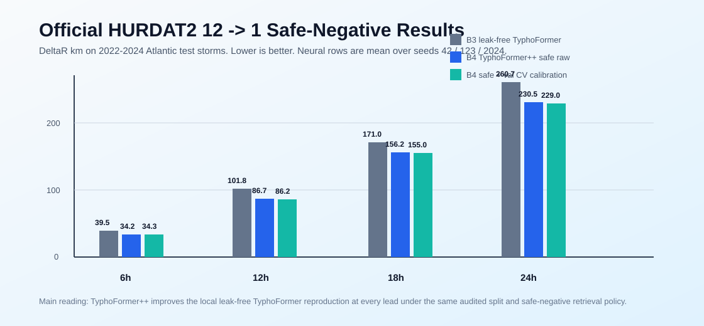
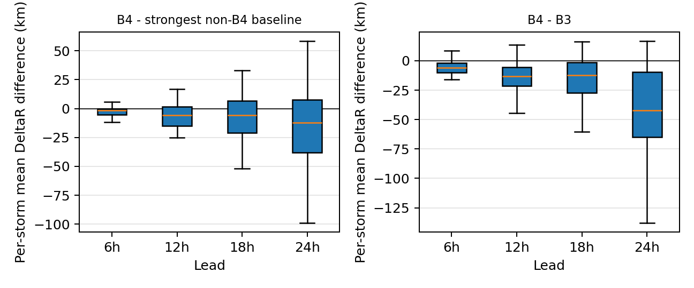
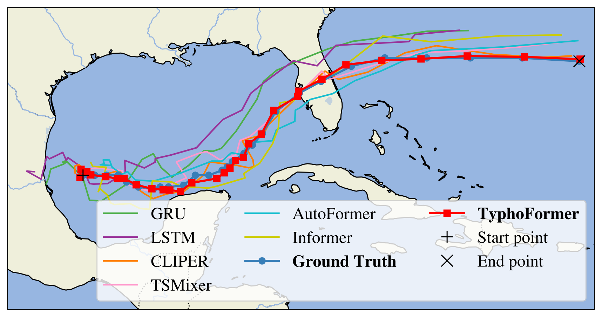

# TyphoFormer++: Robust Hurricane Track Forecasting

[](https://www.python.org/)
[](https://pytorch.org/)
[](https://www.nhc.noaa.gov/data/)
[](#overview)

This repository contains the code, audit scripts, result summaries, and lightweight visual assets for **TyphoFormer++**, a research prototype for retrospective Atlantic hurricane track forecasting. The paper-facing experiments focus on strict 6-hour HURDAT2 windows, storm-level temporal splits, train-only normalization, and leakage-safe analog retrieval.

<p align="center">
  
</p>

The central claim is deliberately scoped: **TyphoFormer++ improves over our local leak-free TyphoFormer reproduction and several local sequence baselines under the same audited official-HURDAT2 protocol.** This repository does **not** claim operational forecasting readiness or superiority over every published TyphoFormer Table 1 number.

## Overview

Tropical cyclone track prediction is sensitive to time alignment, storm leakage, analog retrieval policy, and evaluation protocol. TyphoFormer++ was built to make those assumptions explicit.

Key ideas:

- **Strict 6-hour windows:** inputs and targets use only 0000 / 0600 / 1200 / 1800 UTC synoptic records.
- **Lead-specific 12 -> 1 setting:** four independent targets at 6h, 12h, 18h, and 24h.
- **Storm-level splits:** train/validation storms are from 2004-2021; test storms are from 2022-2024.
- **Safe-negative analog retrieval:** validation/test negative analogs are target-free query neighbors.
- **Dual CV-residual head:** the model learns a direct neural displacement and a constant-velocity residual path.
- **Audit-first reporting:** protocol checks and result summaries are committed next to the code.

## Visual Summary

<p align="center">
  
</p>

<p align="center">
  
  
</p>

The left plot shows storm-level B4-vs-B3 deltas from the TyphoFormer++ diagnostic run. The right image is an example track-forecast visualization bundled with the original TyphoFormer snapshot for continuity with the upstream project.

## Main Result

Official NHC Atlantic HURDAT2, strict 6-hour lead-specific 12 -> 1 protocol. Values are DeltaR in km on 2022-2024 test storms. Lower is better. Neural rows report mean +/- std over seeds 42, 123, and 2024.

| Model | 6h | 12h | 18h | 24h |
|---|---:|---:|---:|---:|
| Persistence | 126.682 | 248.174 | 362.017 | 468.843 |
| Constant Velocity | 36.869 | 95.216 | 170.273 | 256.387 |
| CLIPER-style ridge | 37.277 | 93.245 | 165.417 | 247.663 |
| B2 Numeric Transformer | 39.185 +/- 0.707 | 101.201 +/- 4.731 | 173.365 +/- 5.238 | 265.277 +/- 8.332 |
| B3 leak-free TyphoFormer | 39.462 +/- 0.665 | 101.775 +/- 1.686 | 170.988 +/- 4.322 | 260.721 +/- 6.654 |
| B4 TyphoFormer++ safe raw | 34.153 +/- 0.507 | 86.712 +/- 1.081 | 156.200 +/- 4.628 | 230.528 +/- 1.302 |
| B4 TyphoFormer++ safe + val CV calibration | 34.295 +/- 0.458 | 86.160 +/- 0.825 | 154.985 +/- 4.902 | 228.959 +/- 2.043 |

## Storm-Level Bootstrap

B4 - B3 paired DeltaR in km. Negative means TyphoFormer++ is better. Storm means are averaged over seeds first, then bootstrapped over test storms.

| Lead | Storms | B3 storm mean | B4 storm mean | B4-B3 delta | 95% CI | B4 better storms |
|---:|---:|---:|---:|---:|---:|---:|
| 6h | 41 | 41.023 | 35.698 | -5.326 | [-7.088, -3.571] | 85.4% |
| 12h | 36 | 108.862 | 97.596 | -11.266 | [-19.156, -3.011] | 80.6% |
| 18h | 35 | 185.140 | 170.528 | -14.612 | [-27.522, 1.069] | 74.3% |
| 24h | 30 | 278.032 | 249.723 | -28.309 | [-51.322, -0.417] | 83.3% |

## Ablation Summary

Values are DeltaR km, mean +/- std over seeds 42 / 123 / 2024.

| Variant | 6h | 12h | 18h | 24h |
|---|---:|---:|---:|---:|
| B3 leak-free TyphoFormer | 39.462 +/- 0.665 | 101.775 +/- 1.686 | 170.988 +/- 4.322 | 260.721 +/- 6.654 |
| B3 + dual CV-residual head | 33.833 +/- 0.468 | 86.462 +/- 0.326 | 153.768 +/- 2.346 | 236.483 +/- 3.212 |
| B3 + positive analog only | 39.200 +/- 0.340 | 96.898 +/- 3.395 | 175.832 +/- 6.034 | 260.644 +/- 10.107 |
| B3 + alignment/rank only | 43.047 +/- 1.205 | 106.165 +/- 2.973 | 176.821 +/- 2.943 | 281.220 +/- 8.686 |
| B4 safe TyphoFormer++ | 34.153 +/- 0.507 | 86.712 +/- 1.081 | 156.200 +/- 4.628 | 230.528 +/- 1.302 |

Interpretation: the dual CV-residual head is the dominant contributor. Positive analog memory and alignment/ranking are supporting signals, and text-template features should be interpreted as deterministic structured features rather than evidence for free-form language semantics.

## Repository Structure

```text
.
|-- README.md
|-- requirements.txt
|-- assets/
|   |-- typhoformerpp_overview.svg
|   |-- results_deltaR.svg
|   |-- per_storm_b4_deltas.png
|   |-- milton_track_prediction.png
|   `-- original_typhoformer_results.png
|-- TyphoFormerPlus/
|   |-- model/
|   |   |-- TyphoFormerPlus.py
|   |   |-- TyphoFormer.py
|   |   |-- STTransformer.py
|   |   `-- PGF_module.py
|   |-- prepare_official_hurdat2_pp_data.py
|   |-- train_typhoformerpp.py
|   |-- eval_typhoformerpp.py
|   |-- audit_official_protocol.py
|   |-- run_official_leadspecific_12to1_experiments.ps1
|   |-- run_official_12to1_ablation_full_safeneg.ps1
|   |-- official_*_summary.md/json
|   |-- RESULTS_INDEX.md
|   `-- ARTIFACT_README.md
`-- TyphoFormer_original/
    `-- original TyphoFormer reference snapshot
```

Large generated datasets, checkpoints, run logs, and model weights are intentionally excluded from Git by `.gitignore`.

## Installation

```bash
git clone https://github.com/WYH302/TyphoFormer-for-Hurricane-Track-Forecasting.git
cd TyphoFormer-for-Hurricane-Track-Forecasting

python -m venv .venv
.venv\Scripts\activate
pip install -r requirements.txt
```

For GPU training, install the PyTorch build that matches your CUDA version from the official PyTorch selector before running the long experiments.

## Data Preparation

The repository includes a small HURDAT2-style CSV sample for code inspection and compatibility with the original TyphoFormer pipeline. The official paper-facing runs use the NHC Atlantic HURDAT2 archive.

Place the official HURDAT2 text file here:

```text
TyphoFormerPlus/data_official/hurdat2_atl_1851_2024.txt
```

Then generate strict 6-hour lead-specific data. The current data-preparation script writes the safe-negative validation/test retrieval policy by default. For one lead:

```powershell
cd TyphoFormerPlus
python prepare_official_hurdat2_pp_data.py `
  --hurdat2 data_official\hurdat2_atl_1851_2024.txt `
  --output-dir data_official_pp_12to1_lead1_safeneg `
  --input-len 12 `
  --pred-len 1 `
  --target-lead-step 1 `
  --train-years 2004-2021 `
  --test-years 2022-2024 `
  --val-ratio 0.10 `
  --split-seed 42 `
  --force
```

Repeat with `--target-lead-step 2`, `3`, and `4` for 12h, 18h, and 24h targets.

## Training and Evaluation

From `TyphoFormerPlus/`:

```powershell
# Paper-facing safe-negative attribution ablation
.\run_official_12to1_ablation_full_safeneg.ps1

# Strong sequence baselines
.\run_official_12to1_sequence_baselines_safeneg.ps1

# Text-template ablation
.\run_official_12to1_text_ablation_safeneg.ps1

# Legacy non-safeneg lead-specific reconstruction kept for comparison
.\run_official_leadspecific_12to1_experiments.ps1
```

Single-run entry points are also available:

```bash
python train_typhoformerpp.py --help
python eval_typhoformerpp.py --help
python eval_official_cliper_baselines.py --help
```

## Protocol Audit

Before treating a generated dataset as paper evidence, run:

```powershell
cd TyphoFormerPlus
python audit_official_protocol.py --output-json official_12to1_protocol_audit.json
```

The expected paper-facing result is `total_failures = 0`. The audit checks split disjointness, strict 6-hour timestamps, lead alignment, test-year isolation, train-only analog candidates, same-storm exclusions, and safe-negative retrieval policy.

## Detailed Artifacts

- Main artifact notes: [`TyphoFormerPlus/ARTIFACT_README.md`](TyphoFormerPlus/ARTIFACT_README.md)
- Full results index: [`TyphoFormerPlus/RESULTS_INDEX.md`](TyphoFormerPlus/RESULTS_INDEX.md)
- Main safe-negative summary: [`TyphoFormerPlus/official_leadspecific_12to1_safeneg_summary.md`](TyphoFormerPlus/official_leadspecific_12to1_safeneg_summary.md)
- Full ablation summary: [`TyphoFormerPlus/official_12to1_ablation_full_safeneg_summary.md`](TyphoFormerPlus/official_12to1_ablation_full_safeneg_summary.md)
- Storm bootstrap summary: [`TyphoFormerPlus/official_12to1_storm_bootstrap_safeneg_summary.md`](TyphoFormerPlus/official_12to1_storm_bootstrap_safeneg_summary.md)

## Important Scope Notes

- This is retrospective research code based on best-track data, not an operational hurricane forecast system.
- The CLIPER-style ridge row is a local retrospective control, not the official NHC CLIPER implementation.
- The official Table 1 comparison remains protocol-sensitive; the defensible claim here is improvement over the local leak-free reproduction and local baselines under the same strict protocol.
- Checkpoints, generated `.npy` datasets, and run logs are omitted from Git. Recreate them with the scripts above or store them through a release, cloud drive, or Git LFS.

## Citation

If this repository supports your work, please cite the project URL for now. A paper-specific BibTeX entry will be added after the manuscript metadata is finalized.

```bibtex
@misc{typhoformerpp2026,
  title        = {TyphoFormer++: Robust Hurricane Track Forecasting under Strict HURDAT2 Protocols},
  author       = {Anonymous Authors},
  year         = {2026},
  howpublished = {\url{https://github.com/WYH302/TyphoFormer-for-Hurricane-Track-Forecasting}},
  note         = {Research code and experiment artifacts}
}
```

## Acknowledgement

This repository includes an original TyphoFormer reference snapshot for reproducibility and comparison. TyphoFormer++ extends the local reproduction with strict protocol audits, safe-negative analog retrieval, additional baselines, and a dual CV-residual forecasting head.
